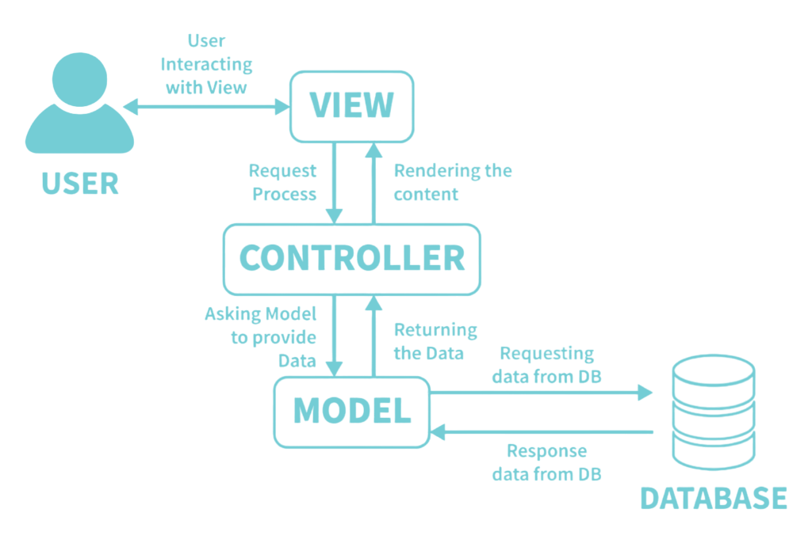

# SignAndMarking - Product Selling Platform

## 📌 About the Project

**SignAndMarking** is a web application built with **ASP.NET Core MVC** for selling various products related to road traffic organization and road markings. The platform allows customers to **browse and purchase products**, with full **authentication and authorization** for secure access. The application also allows **admins to add product cards** for display on the site.

✅ **Key Features:**
- **Customer Authentication and Authorization** using `ASP.NET Core Identity`
- **Product management** with the ability to add, update, and delete products
- **Responsive design** with `Bootstrap` for mobile compatibility
- **Fontawesome** for modern icons and user interface elements



---

## ⚙️ Technology Stack

- **Programming languages:** `C#`
- **SDK:** `.NET 8`
- **Frameworks:** `ASP.NET Core MVC`
- **Persistence:**
  - **Database:** `MS SQL`
  - **ORM:** `Entity Framework Core 8.0`
- **Authentication:** `ASP.NET Core Identity`
- **UI:** `Bootstrap`, `Fontawesome`
- **IDE:** `Rider`, `Visual Studio`

---

## 💻 Development Environment

- **.NET SDK:** `.NET 8.0.101`
- **Check installed SDK version:**
  ```sh
  dotnet --version